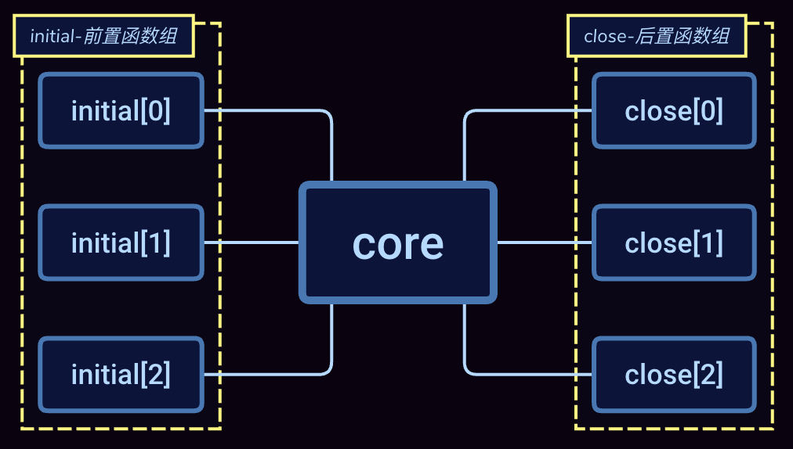

# Request Provider

[](./LICENSE)
[](https://www.npmjs.com/package/request-provider)
[](https://www.npmjs.com/package/request-provider)
[](https://circleci.com/gh/Lighting-Jack/request-provider/tree/master)

以 [AOP](https://zh.wikipedia.org/wiki/%E9%9D%A2%E5%90%91%E4%BE%A7%E9%9D%A2%E7%9A%84%E7%A8%8B%E5%BA%8F%E8%AE%BE%E8%AE%A1) 编程思想为核心，提供函数使用的一种思路，将想要执行的函数看作是切入点，切入点前需要做的任务看作是前置任务，切入点后需要做的任务看作是后置任务。

[中文版文档](./README.md)

## Installation

```
npm install request-provider -g
```

## Examples

```javascript
import { TransactionImpl, wrappers } from '../src/index'
import * as request from 'request-promise'

const wrappers = {
  initial: [
    async ctx => {
      const options = ctx.arguments[0]
      options.url = 'http://www.baidu.com'
      console.log('rp-start', ctx.arguments[0])
    }
  ],
  close: [async ctx => console.log('rp-end', ctx.ret)]
} as wrappers

const requestAop = new TransactionImpl(wrappers)
requestAop.performAsync(request, null, {
    url: '',
    method: 'get'
  })
```

这个例子展示了将 request 作为切入点，前置函数对 request 的入参进行了赋值操作，后置函数打印了 request 返回的内容。例子比较简单，但是结合具体的场景，可以实现很多非常便利的操作。

## Wrapper

你需要自定义`wrapper`，wrapper 是包含下面两个属性的普通对象

| 属性    |        含义        |
| :------ | :----------------: |
| initial | 切入点的前置函数组 |
| close   | 切入点的后置函数组 |

## PerformSync & PerformAsync

TransactionImpl 的实例提供了 PerformSync 和 PerformAsync 两个公共 api， 分别对应于同步和异步的处理场景。

| 入参         |          含义           |
| :----------- | :---------------------: |
| method       |   将该函数视为切入点   |
| scope        |   切入点所在的作用域    |
| ...arguments | 切入点最多支持 6 个入参 |

## Action Flow



## Licence

[MIT](./LICENSE)
